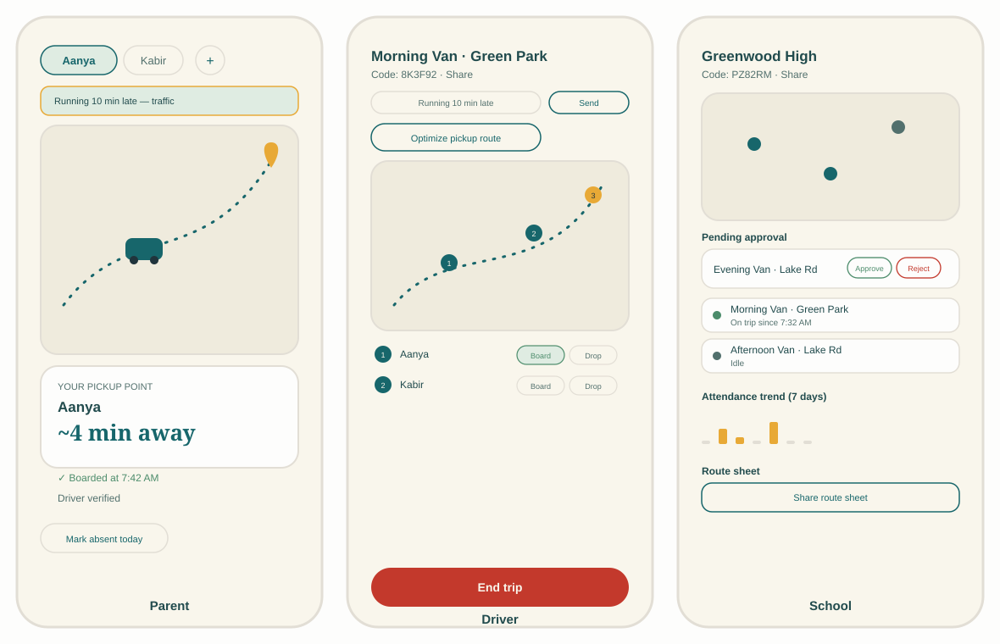
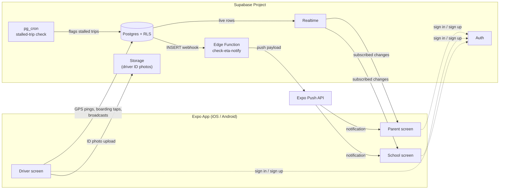
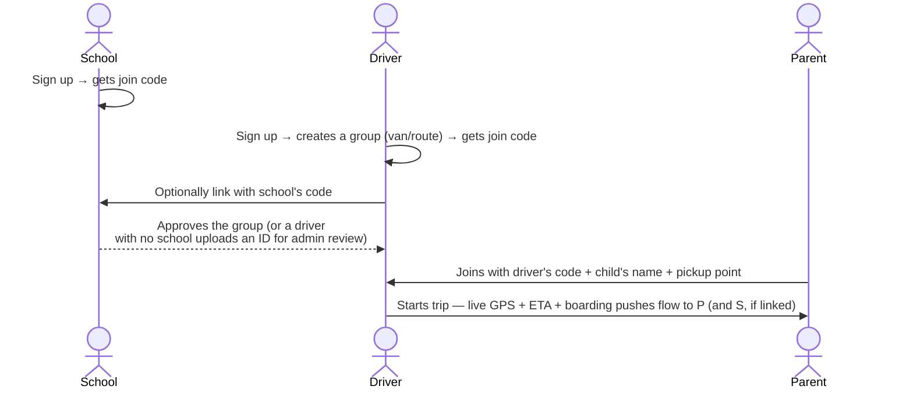

<p align="center">
  
</p>

<p align="center">
  
  
  
  
  
  
</p>

## What is Busgo?

Every school-morning, the same scene repeats outside houses across the country: a parent standing
at the gate, phone in hand, with no idea whether the van is two minutes away or twenty. Busgo fixes
that with **live GPS tracking** parents can actually see, backed by a **self-service** model — no
admin has to provision anyone. A school signs up and gets a code. A driver signs up, creates their
own van/route, and optionally links it to a school with that code. A parent signs up and joins their
driver's group with *that* code, drops a pin (or types an address) for their own pickup point, and
lands straight on a live map with a running ETA.

No admin dashboards to populate, no spreadsheets of routes to maintain by hand, and no Google Maps
billing account required to run it.

<p align="center">
  
</p>

> The screens above are illustrative mockups built from the app's actual component layout and
> color system, not live screenshots — the fastest way to show the shape of all three roles at
> once without stitching together a real device's photo roll. Real screenshots can replace these
> the next time the app is running on a device; open an issue or ask and they'll go in here.

## Who uses it, and how

| Role | Gets in with | Can do |
|---|---|---|
| **School** | Sign up, get a join code | See every linked van's live status, approve/reject drivers before they appear on the fleet map, view a 7-day attendance-trend chart per van, share a route sheet of every code at once |
| **Driver** | Sign up, create a group (their van/route), optionally paste a school's code to link | Start/end trips (broadcasts GPS live), get an auto-optimized pickup order for today's roster, mark each child boarded/dropped-off, broadcast a delay message to every parent at once, see a boarded-vs-no-show summary when the trip ends |
| **Parent** | Sign up, enter a driver's join code + child's name + pickup point (current location or a typed address) | Watch the bus live on a map, get a push notification a few minutes before arrival, mark a child absent (single day or a multi-day range), see boarding/drop-off confirmations and past trip history, see whether the driver has been verified |
| **Admin** *(optional, Supabase Studio only)* | `profiles.role = 'admin'` | Spot-check any school/group/trip; the only role that reviews and approves independent (no-school) drivers' uploaded ID photos |

## Features

**Live tracking & routing**
- Real-time GPS broadcast during an active trip, rendered on an OpenStreetMap/Leaflet map (no API key, no billing account)
- Multi-start nearest-neighbor + 2-opt + Or-opt route optimization — one tap gives a driver a sensible pickup order for today's roster, computed on-device
- Pickup location by current GPS position *or* free-text address search (Nominatim/OpenStreetMap geocoding)
- Straight-line ETA estimate shown to parents, refreshed live as the bus moves

**Safety & trust**
- **Driver verification**, two paths: a school explicitly approves a group linked to it before it appears on the fleet map; an independent (no-school) driver uploads a photo of their license/ID for an admin to review in-app
- **Speed & stopped-bus alerts** pushed to the school — a bus going unusually fast, or one that's stopped sending location updates for 10+ minutes mid-trip, both trigger a push automatically
- Row Level Security on every table — a parent can only ever see their own child's data, a driver only their own group, a school only what's linked to it

**Attendance & communication**
- Drivers tap each child boarded/dropped-off during a trip; parents get a push the moment it happens
- A boarded-vs-no-show summary appears automatically when a driver ends a trip
- Parents mark a child absent for today or a multi-day range — the driver's roster and route optimization exclude them automatically for that day
- One-tap or free-text delay/incident broadcasts from a driver to every parent in their group at once
- A parent-facing trip-history screen of every past boarding/drop-off event

**Reliability**
- GPS points buffer locally (and resend in order) if a driver's connection drops mid-trip, instead of silently vanishing
- A school's weekly attendance-trend chart, built entirely from data already being collected — no separate reporting pipeline

## Tech stack

- **App**: React Native 0.86 + Expo SDK 57 (TypeScript), Expo Router (file-based, typed routes), React 19
- **Backend**: Supabase — Postgres, Row Level Security, Realtime (`postgres_changes`), Auth, Storage, Edge Functions (Deno), `pg_cron` for periodic checks
- **Maps**: OpenStreetMap tiles via Leaflet inside a `react-native-webview`, plus free Nominatim geocoding for address search — deliberately free, no Google Cloud billing
- **Push**: `expo-notifications` + Expo's push API, dispatched from a single shared Edge Function on Database Webhooks
- **UI**: a small custom design system (`Button`, `TextField`, themed light/dark tokens) built on Fraunces + DM Sans, `lucide-react-native` icons

## How it fits together





## Project structure

```
src/
  app/                  Expo Router screens, grouped by role: (auth) (driver) (parent) (school) (admin)
  components/           Shared UI (Button, TextField) + feature components (map, roster, forms, badges)
  hooks/                Data hooks — one per live-updating concern (roster, trip, boarding status, ...)
  lib/                  supabase client, auth context, routing/geocoding/location/eta/date helpers
  types/database.ts     Hand-written types mirroring the Postgres schema
supabase/
  migrations/           Numbered SQL migrations — schema, RLS policies, RPCs, in that order
  functions/
    check-eta-notify/   The one shared Edge Function; dispatches on which table's webhook fired it
```

## Getting started

### 1. Supabase project

```bash
npx supabase login
npx supabase link --project-ref <your-project-ref>
npx supabase db push        # applies every migration — schema, RLS, RPCs, cron job
```
Nothing to seed by hand — schools, groups, and students are all created through the app's own UI
via join codes.

### 2. Environment variables

```bash
cp .env.example .env
```
Fill in `EXPO_PUBLIC_SUPABASE_URL` and `EXPO_PUBLIC_SUPABASE_PUBLISHABLE_KEY` from Project Settings
→ API in Supabase Studio (the *publishable* key — safe for client use, since RLS is what actually
enforces access control).

### 3. Run it

`react-native-webview` and the location/notification/image-picker plugins are native modules, so
**Expo Go won't run this app** — you need a dev client:

```bash
npx expo install
eas build --profile development --platform android   # or --platform ios
npm run android   # or npm run ios / npm run web
```

Then, entirely from the app:
1. Sign up as a **driver** → create a group → get a join code.
2. Optionally sign up as a **school** first → create it → paste its code into the driver's
   "Link to a school" field.
3. Sign up as a **parent** → enter the driver's join code, your child's name, and a pickup point.
4. Back on the driver account, tap **Start trip** — GPS starts broadcasting and everything above
   lights up live.

### 4. Push notifications

The shared `check-eta-notify` Edge Function is deployed and its `WEBHOOK_SECRET` is set, but three
Database Webhooks have to be created by hand in Supabase Studio (the dashboard is the only way —
there's no CLI equivalent), each an INSERT trigger on the tables below calling `check-eta-notify`
with a custom header `x-webhook-secret` set to the same secret value:

- `trip_locations` — ETA-proximity pushes to parents, and speed alerts to schools
- `boarding_events` — boarded/dropped-off pushes to parents
- `group_messages` — delay/incident broadcasts to parents
- `trip_alerts` — speeding and stopped-bus alerts to schools

Test with the receiving app **fully backgrounded** — that's the actual point of a push, not just
an in-app banner. Real GPS and push notifications don't behave reliably in simulators; verify on
physical hardware before trusting a milestone as "working."

### 5. Building for the stores

```bash
eas secret:create --name EXPO_PUBLIC_SUPABASE_URL --value <your-value>
eas secret:create --name EXPO_PUBLIC_SUPABASE_PUBLISHABLE_KEY --value <your-value>
eas build --profile preview --platform all     # real-device test build
eas build --profile production --platform all
eas submit --platform android
eas submit --platform ios
```
Needs a Google Play Console account ($25 one-time) and an Apple Developer Program membership
($99/year). Both stores require a privacy policy URL at submission time, since the app requests
location.

## Known gaps

Honestly listed rather than hidden — none block local development, but all matter before a real
public launch:

- App icon and splash screen are still Expo's scaffolding defaults (only background colors were
  themed) — cosmetic, but the first thing anyone sees
- No driver background-check integration — verification confirms a school/admin *approved* a
  driver, not a criminal-record check
- The self-service join RPCs (`join_group`, `link_group_to_school`) have no rate limiting
- iOS has never been run, only Android
- No account-deletion flow, privacy policy, or Play Data Safety form yet — all required before a
  store submission
